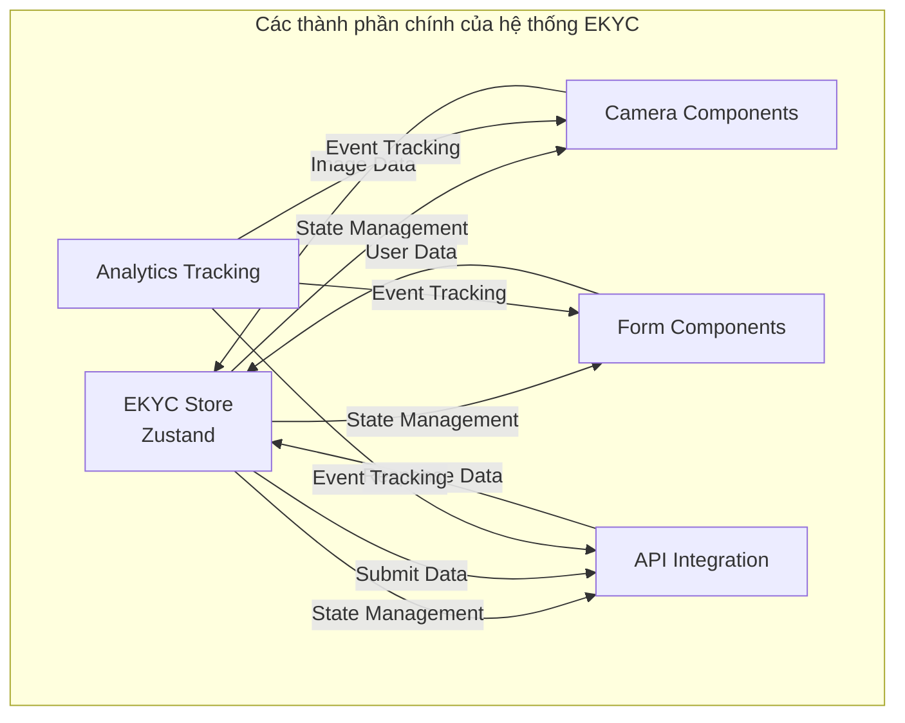
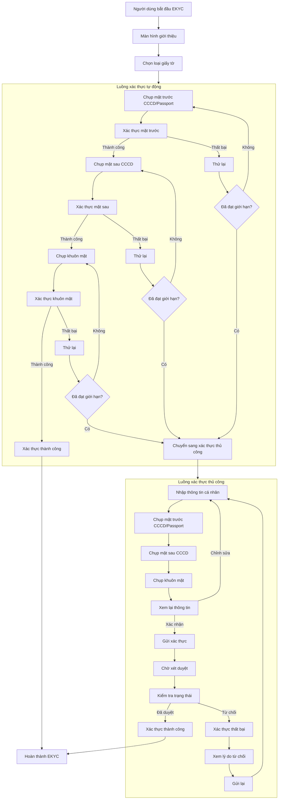
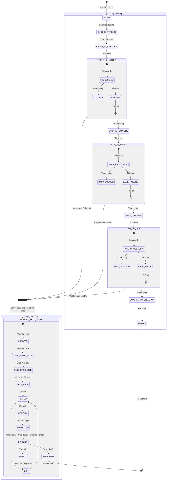
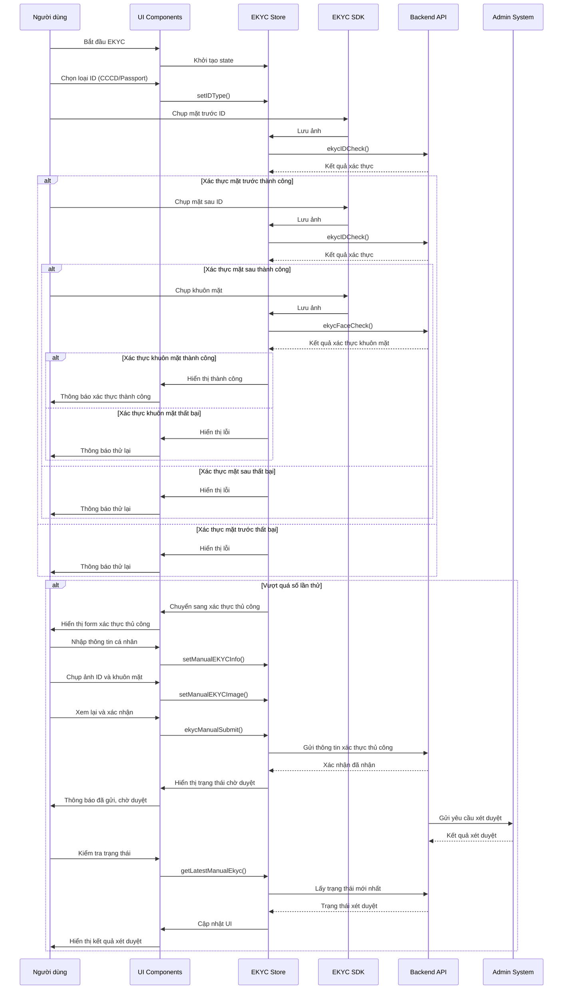
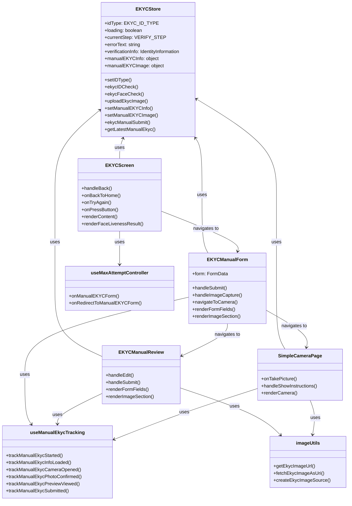

# EKYC System Documentation

## Overview

The Electronic Know Your Customer (EKYC) system provides identity verification functionality for users. The system supports two verification paths:

1. **Automatic Verification**: Uses SDK integration for automated ID card and face verification
2. **Manual Verification**: Fallback option when automatic verification fails, allowing users to manually submit their information and documents

### Tổng quan hệ thống



## System Architecture

### Key Components

1. **EKYC Store**: Central state management using Zustand
2. **API Integration**: Backend communication for verification and data submission
3. **Camera Components**: For capturing ID cards and selfies
4. **Form Components**: For manual data entry
5. **Tracking System**: Analytics for user journey through the verification process

### File Structure

```
src/screens/Menu/EKYC/
├── components/            # Reusable UI components
│   ├── camera/           # Camera capture components
│   ├── DropDownCustom.tsx # Custom dropdown component
│   ├── FooterComponent.tsx # Footer with action buttons
│   └── ImageSection.tsx   # Image display and capture UI
├── hooks/                 # Custom React hooks
│   ├── useEkycFlowActions.tsx # Actions for EKYC flow
│   ├── useManualEkycTracking.ts # Analytics tracking
│   └── useMaxAttemptController.tsx # Handles max attempts logic
├── store/                 # State management
│   ├── actions/           # Store actions
│   │   ├── ekycCheckEligibility.ts # Check if user can attempt verification
│   │   ├── ekycFaceCheck.ts # Face verification
│   │   ├── ekycIDCheck.ts # ID verification
│   │   ├── ekycManualSubmit.ts # Submit manual verification
│   │   └── getLatestManualEkyc.ts # Get latest manual verification
│   └── index.ts           # Store definition and types
├── utils/                 # Utility functions
│   └── imageUtils.ts      # Image processing utilities
├── EKYCScreen.tsx         # Main automatic verification screen
├── EKYCManualForm.tsx     # Manual verification form
├── EKYCManualReview.tsx   # Review screen for manual verification
└── SimpleCameraPage.tsx   # Camera capture page
```

## Data Flow

1. **User Initiates EKYC**:

   - Starts at `EKYCScreen.tsx` with introduction
   - Chooses ID type (CCCD or Passport)

2. **Automatic Verification**:

   - User captures ID front/back and face using SDK
   - System verifies images using `ekycIDCheck.ts` and `ekycFaceCheck.ts`
   - If successful, user is verified
   - If unsuccessful after maximum attempts, redirects to manual verification

3. **Manual Verification**:
   - User enters personal information in `EKYCManualForm.tsx`
   - Captures ID images and selfie using `SimpleCameraPage.tsx`
   - Reviews information in `EKYCManualReview.tsx`
   - Submits for manual review by admin using `ekycManualSubmit.ts`
   - User can check status and resubmit if rejected

### Biểu đồ luồng EKYC



## State Management

The EKYC system uses Zustand for state management with the following key states:

### Main States

```typescript
// From store/index.ts
export enum MANUAL_EKYC_STATE {
  CREATED = "CREATED",
  EDIT = "EDIT",
  CONFIRM = "CONFIRM",
  PENDING = "PENDING",
  APPROVED = "APPROVED",
  REJECT = "REJECT",
  SUBMITTED = "SUBMITTED",
  REVIEW = "REVIEW",
  TAKE_PHOTO = "TAKE_PHOTO",
  TAKE_FACE = "TAKE_FACE",
  TAKE_BACK_SIDE = "TAKE_BACK_SIDE",
  TAKE_FRONT_SIDE = "TAKE_FRONT_SIDE",
}

export interface IProfileVerificationState extends IBaseState {
  idType: EKYC_ID_TYPE;
  loading: boolean;
  currentStep: VERIFY_STEP;
  errorText: string;
  verificationInfo?: IdentityInformation;
  shouldRetakeFrontSide: boolean;
  verifyResult: boolean;
  ekycEligibility?: IEKYCEligibilityResponse;
  latestManualEkyc?: IEKYCManualLatestResponse;

  // Manual EKYC information
  manualEKYCInfo: {
    fullName: string;
    birthDate: string;
    sex: string;
    nation: string;
    rejectReason: string;
    state: MANUAL_EKYC_STATE;
  };

  // Manual EKYC images
  manualEKYCImage: {
    frontSide: string;
    backSide: string;
    face: string;
  };
}
```

### Key Actions

1. **setIDType**: Set the type of ID (CCCD or Passport)
2. **ekycIDCheck**: Verify ID card images
3. **ekycFaceCheck**: Verify face image
4. **uploadEkycImage**: Upload images to the server
5. **ekycManualSubmit**: Submit manual verification data
6. **getLatestManualEkyc**: Get the latest manual verification status
7. **setManualEKYCInfo**: Update manual verification information
8. **setManualEKYCImage**: Update manual verification images

## API Integration

### Key Endpoints

1. **ID Verification**: Verifies ID card images
2. **Face Verification**: Verifies face image and matches with ID
3. **Manual Submission**: Submits manual verification data
4. **Check Eligibility**: Checks if user can attempt verification
5. **Get Latest Manual EKYC**: Gets the latest manual verification status

### Image Handling

Images are handled using the utilities in `imageUtils.ts`:

1. **getEkycImageUrl**: Creates URL for EKYC images
2. **fetchEkycImageAsUri**: Fetches image and converts to local URI
3. **createEkycImageSource**: Creates source object for Image components

## User Flow

### Automatic Verification Flow

1. User starts at introduction screen
2. User selects ID type (CCCD or Passport)
3. User captures front ID using SDK
4. System verifies front ID
5. User captures back ID (if required)
6. System verifies back ID
7. User captures face
8. System verifies face and matches with ID
9. If all verifications pass, user is verified
10. If any verification fails after maximum attempts, user is redirected to manual verification

### Manual Verification Flow

1. User is redirected to manual form after automatic verification fails
2. User enters personal information (name, birth date, sex, nationality)
3. User captures ID front using camera
4. User captures ID back (if required)
5. User captures face
6. User reviews all information
7. User submits for manual review
8. User can check status and resubmit if rejected

### Biểu đồ trạng thái EKYC



## Analytics Tracking

The system uses `useManualEkycTracking.ts` to track user journey:

1. **MANUAL_EKYC_STARTED**: When manual EKYC flow starts
2. **MANUAL_EKYC_INFO_LOADED**: When form is loaded
3. **MANUAL_EKYC_CAMERA_OPENED**: When camera is opened
4. **MANUAL_EKYC_PHOTO_CONFIRMED**: When photo is confirmed
5. **MANUAL_EKYC_PREVIEW_VIEWED**: When preview screen is viewed
6. **MANUAL_EKYC_EDIT_MODE_OPENED**: When edit mode is opened
7. **MANUAL_EKYC_SUBMITTED**: When form is submitted
8. **MANUAL_EKYC_INSTRUCTION_OPENED**: When instructions are opened
9. **MANUAL_EKYC_CANCELED**: When user cancels the flow

## Error Handling

1. **Maximum Attempts**: If user exceeds maximum verification attempts, they are redirected to manual verification
2. **API Errors**: Displayed to user with option to retry
3. **Image Capture Errors**: User can retake photos

## Implementation Details

### Manual EKYC Form (`EKYCManualForm.tsx`)

This component handles the manual data entry form with the following features:

- Form validation using React Hook Form
- Date picker for birth date
- Country selection dropdown
- Image capture integration
- Form state persistence

### Manual EKYC Review (`EKYCManualReview.tsx`)

This component displays the review screen with:

- All entered information for confirmation
- Image previews
- Edit functionality
- Submit button

### Simple Camera Page (`SimpleCameraPage.tsx`)

This component handles image capture with:

- Camera integration
- Image preview
- Retake functionality
- Image size tracking

### Maximum Attempt Controller (`useMaxAttemptController.tsx`)

This hook manages the maximum verification attempts:

- Tracks number of attempts
- Shows alert when maximum attempts reached
- Redirects to manual verification

### Biểu đồ tuần tự EKYC



## Integration with External Systems

### EKYC SDK Integration

The system integrates with an external EKYC SDK for automatic verification:

- Configuration in `useEkycFlowActions.tsx`
- SDK initialization and usage
- Result handling and parsing

### Backend API Integration

The system communicates with backend APIs for:

- Image verification
- Data submission
- Status checking

## Testing

To test the EKYC system:

1. **Automatic Verification**:

   - Test with valid ID cards
   - Test with invalid ID cards
   - Test with different lighting conditions
   - Test maximum attempts logic

2. **Manual Verification**:
   - Test form validation
   - Test image capture
   - Test submission process
   - Test rejection and resubmission flow

## Common Issues and Solutions

1. **Image Quality Issues**:

   - Ensure good lighting
   - Hold camera steady
   - Follow on-screen guidelines

2. **Verification Failures**:

   - Check ID card is valid and not expired
   - Ensure face is clearly visible
   - Try manual verification if automatic fails

3. **Form Submission Errors**:
   - Check all required fields are filled
   - Verify image uploads are complete
   - Check network connection

## Future Improvements

1. **Offline Support**: Add capability to capture and store verification data offline
2. **Enhanced Image Processing**: Improve image quality checks before submission
3. **Multi-language Support**: Extend support for more languages
4. **Accessibility Improvements**: Enhance for users with disabilities

## Cấu trúc lớp



## Conclusion

The EKYC system provides a robust verification solution with both automatic and manual paths. The manual verification flow serves as a critical fallback when automatic verification fails, ensuring all users can complete the verification process.
